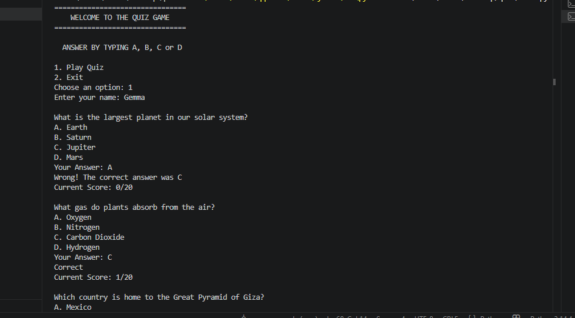
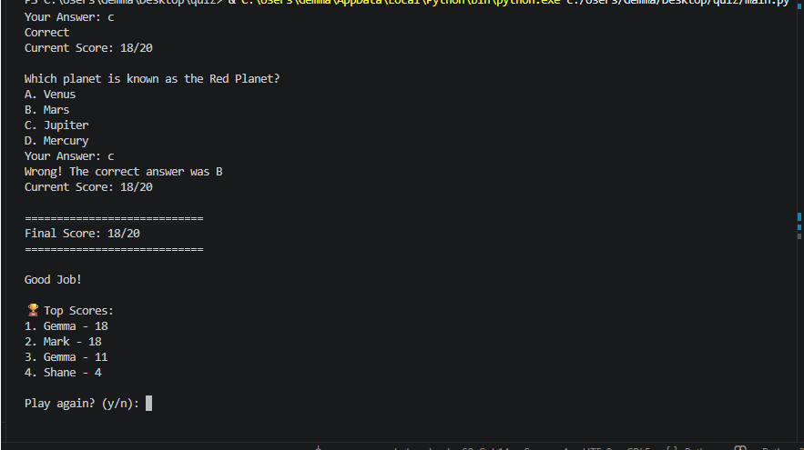

# Quiz Game 🎮
A command-line quiz game built with Python featuring a persistent leaderboard system and replayable gameplay loop.

## Features
- Multiple choice questions
- Randomised question order
- Score tracking
- High score saved to file
- Input validation
- Replay option

## 🛠️ Tech Stack
- Python
- JSON 
- File Handling

## ✨ Project Highlights

- Built a full CLI game using Python
- Implemented persistent leaderboard using JSON
- Randomised question selection each session
- Real-time score tracking during gameplay
- Modular code structure (main, quiz, storage)

## 📚 What I Learned

- File handling in Python
- Working with JSON data
- Modular program structure
- Basic game loop design
- Git and GitHub workflow

## How to Run
1. Clone the repo
2. Run:
   python main.py

## 🖥️ Preview
 

